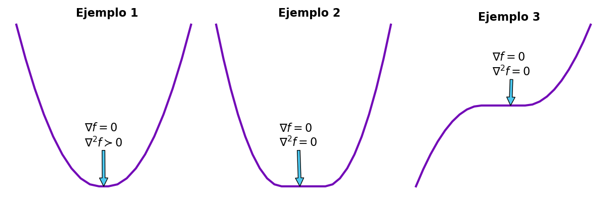

# **Optimización**

## **Derivada parcial**

Calcular la derivada parcial de una función que mapea un vector a un valor escalar ($f: \mathbb{R}^n \rightarrow \mathbb{R}$), corresponde a calcular la derivada de la función respecto a esa variable asuminedo las demás variables son constantes. Esto es:
$$
\large
\frac{\partial f(x_1,x_2,x_3,\dots,x_i,\dots,x_n)}{\partial x_i} \overset{def}{=}\underset{h\rightarrow 0}{lim}\;\; \frac{f(x_1,x_2,x_3,\dots,x_i+h,\dots,x_n)-f(x_1,x_2,x_3,\dots,x_i,\dots,x_n)}{h}
$$
lo cual, se puede escribir de la siguiente manera:
$$
\frac{\partial f(x)}{\partial x_i}  \overset{def}{=}\underset{h\rightarrow 0}{lim}\;\; \frac{f(x+he_i)-f(x)}{h}
$$
donde $x$ es un vector de dimensión $n$ y $e_i$ es un vector unitario, el cual tiene ceros en cada posición excepto en $i$ donde se encuentra un uno.  

## **Gradiente y jacobiano**

En matemáticas, el gradiente es una generalización de la derivada, ya que la derivada de una función esta definida para unicamente funciones de una variable. El gradiente es una función de valor vectorial. El gradiente esta definido como:
$$
\large
\nabla_f(x) \overset{def}{=} \left(
\begin{matrix}
\frac{\partial f(x)}{\partial x_1} \\\\
\frac{\partial f(x)}{\partial x_2} \\\\
\frac{\partial f(x)}{\partial x_3} \\\\
\vdots \\\\
\frac{\partial f(x)}{\partial x_n}
\end{matrix}
\right)
$$
Con ello, se puede observar que el operador gradiente lleva a una función $n$ variabas variables a un vector de dimensión $n$ donde el elemento i-esimo es la derivada parcial de la función con respecto a la variable $i$. El operador del gradiente se escribe como $\nabla \{\}$ y el vector gradiente como $\nabla_f$  

Por otro lado, si se tiene una función que mapea de un espacio vectorial de dimensión $n$ a un espacio de dimensión $m$ $(f:\mathbb{R}^n \rightarrow \mathbb{R}^m)$, el concepto de derivada no se encuetra definido con el operador gradiente. Es por ello que se necesita definir el concepto del operador jacobiano. La definición del jacobiano es la siguiente:  
Sea $f: \mathbb{R}^n \rightarrow \mathbb{R}^m$, una función cuyas derivadas parciales de primer orden existen en todo $\mathbb{R}^n$ y denotemos como $f_1,f_2,f_3,\dots,f_m$ a sus componentes escalares. Se define la matriz jacobiana de $f$ en un punto $x \in \mathbb{R}^n$ como:
$$
\large
J_f(x) = \left(
\begin{matrix}
\frac{\partial f_1(x)}{\partial x_1} &\frac{\partial f_1(x)}{\partial x_2} & \dots &\frac{\partial f_1(x)}{\partial x_n} \\\\
\frac{\partial f_2(x)}{\partial x_1} &\frac{\partial f_2(x)}{\partial x_2} & \dots &\frac{\partial f_2(x)}{\partial x_n} \\\\
\frac{\partial f_3(x)}{\partial x_1} &\frac{\partial f_3(x)}{\partial x_2} & \dots &\frac{\partial f_3(x)}{\partial x_n} \\\\
\vdots & \vdots & \ddots &\vdots \\\\
\frac{\partial f_m(x)}{\partial x_1} &\frac{\partial f_m(x)}{\partial x_2} & \dots &\frac{\partial f_m(x)}{\partial x_n} \\\\
\end{matrix}
\right)
$$

## **Hessiano**

La matriz hessiana o hessiano de un campo escalar es una matriz cuadrada de dimensión $n \times n$ que tiene como elementos las derivadas parciales de segundo orden. La matriz hessiana se define como:  

Sea $f: \mathbb{R}^n \rightarrow \mathbb{R}$, un campo escalar cuyas derivadas parciales de segundo grado existen (clase $C^2$). La matriz hessiana de $f$, denotada por $H_f(x)$, es una matriz cuadrada $n \times n$ definida como:
$$
\large
H_f(x) = \left(
\begin{matrix}
\frac{\partial^2 f}{\partial x_1^2} (x) &\frac{\partial^2 f}{\partial x_1 \partial x_2} (x) & \dots & \frac{\partial^2 f}{\partial x_1 \partial x_n} (x) \\\\
\frac{\partial^2 f}{\partial x_2 \partial x_1} (x) &\frac{\partial^2 f}{\partial x_2^2} (x) & \dots & \frac{\partial^2 f}{\partial x_2 \partial x_n} (x) \\\\
\vdots & \vdots & \ddots & \vdots \\\\
\frac{\partial^2 f}{\partial x_n \partial x_1} (x) &\frac{\partial^2 f}{\partial x_n \partial x_2} (x) & \dots & \frac{\partial^2 f}{\partial x_n^2} (x) \\\\
\end{matrix}
\right)
$$
Con ello, se afirma que el hessiano es aplicar el operador jacobiano al gradiente de la función $f$.
$$
H_f(x) = J\lbrace \nabla f(x)\rbrace = J\lbrace J_f^T \rbrace
$$
Por otro lado, en algunos casos es más preferible calcular el hessiano por medio del operador gradiente. Para lograr este objetivo se define la operación divergencia el cual es la siguiente:
$$
\nabla \cdot f \overset{def}{=} 1^T\nabla f
$$
Con esto se tiene que el hessiano es calculado como:
$$
\nabla^2 f = \nabla^T \nabla f
$$

## **Convexidad**

### **Conjunto convexo**

Un conjunto $\Omega \subseteq \mathbb{R}^n $ es convexo si
$$
\lambda x +(1-\lambda)y \in \Omega, \forall x,y \in \Omega\;\text{y}\; \lambda\in [0,1]
$$

### **Función convexa**

Una función $f: D\rightarrow\mathbb{R}$ es estrictamente convexa si su dominio $D\subset \mathbb{R}^n$ es convexo, y para todo $x,y \in D$ para todo $\lambda \in [0,1]$, se verifica
$$
f(\lambda x + (1-\lambda)y) \leq \lambda f(x) (1-\lambda) f(x)
$$
Se dice que una función es convexa cuando no se requiere la igualdad de los terminos. Algunos ejemplos de funciones convexas son:
$$
\begin{aligned}
f(x)&=x^2 & \text{Función cuadratica}\nonumber \\\\
f(x)&=Ax+b & \text{Funciones afines} \nonumber\\\\
f(x)&=||x|| & \text{Cualquier norma de un vextor} \nonumber\\\\
\end{aligned} \nonumber
$$

### **Funciones convexas diferenciales**

Sea $f: D\rightarrow \mathbb{R}$ diferenciable sobre un dominio convexo y abierto $D$. Entonces, $f$ es convexa si y solo si
$$
f(x) \geq f(\x')+\nabla f(\x')^T (x-\x')
$$
para todo $x,\x' \in D$.

### **Funciones convexas diferenciables dos veces**

Sea $f: D\rightarrow \mathbb{R}$ de clase $C^2$ sobre un dominio convexo y abierto $D$. Entonces, $f$ es convexa si y solo si $H_f(x)$ es semidefinida positiva para todo $x\in D$. Una matriz semidefinida positiva es una matriz hermitiana $M$ cuando se cumple una de las siguientes condiciones:

1. Para todos los vectores no nulos ($x\in \mathbb{R}^n$) tenemos que: $$ x^TMx \geq 0 $$
2. Todos los eigenvalores de $M$ son positivos.
3. La función $$ < x,y  > = x^TMy $$
define un producto interno en $\mathbb{R}^n$.
4. Todos los menores principales de $M$ son positivos.

## **Optimalidad**

La optimización convexa trata el problema general de minimizar una función convexa, sobre un conjunto factible también convexo:
$$
\underset{x\in D}{min}\; f(x)
$$
donde $f:D\rightarrow \mathbb{R}$ es convexa y $ D\subset \mathbb{R}^n$ es convexo. En un problema convexo no hay distinción entre mínimos globales y locales. Es por ello que existen diferentes clasificaciones dependiendo de las condiciones que cumplan. Estas clasificaciones son la siguientes:

- *Óptimo global estricto*: $x^* \in \mathbb{R}^n $ es el óptimo global estricto si $f(y)>f(x^*), \forall y \in \mathbb{R}^n$.
- *Óptimo global*: $x^* \in \mathbb{R}^n $ es el óptimo global si $f(y)\geq f(x^*), \forall y \in \mathbb{R}^n$.
- *Óptimo Local Estricto*: $x^* \in \mathbb{R}^n $ es el óptimo local estricto si $f(y)> f(x^*), \forall y \in \Omega$, donde $\Omega$ es una vecindad abierta que contiene a $x^*$.
- *Óptimo Local*: $x^* \in \mathbb{R}^n$ es el óptimo local estricto si $f(y) \geq f(x^*), \forall y \in \Omega$, donde $\Omega$ es una vecindad abierta que contiene a $x^*$.

### **Minimos globales bajo convexidad**

Considerando el problema de optimización donde se supone que la función $f$ es diferenciable. Un punto $x^* \in D$ es mínimo global si y solo si
$$
\nabla f(x^\*)^T (x-x^\*) \geq 0 \;\;\; \forall x \in D
$$

### **Dirección de descenso**

Se dice que $d$ es una dirección de descenso en el punto $x'$ para el problema propuesto de optimización cuando se cumple que:
$$
f(x') > f(x'+\epsilon d)
$$
donde $\epsilon$ es suficientemente pequeña. Con el fin de encontrar la condición de descenso se utilizara una expansión de la serie de Taylor de la función $f$ en el punto $x'$. Del procedimiento se obtiene lo siguiente:
$$
\begin{aligned}
f(x') & > f(x'+\epsilon d)\nonumber \\\\
& > f(x') + \epsilon \nabla f(x')^T d + \epsilon^2 d^T \nabla^2 f(x') d+ \dots \nonumber \\\\
& \approx f(x') + \epsilon \nabla f(x')^T d \nonumber \\\\
\end{aligned}
$$
dado que $|\epsilon^n| > |epsilon|$ para $n>1$. La dirección de descenso $d$ debe cumplir que:
$$
-\nabla f(x')^T d > 0
$$

### **Condición de optimalidad de primer orden**

Se tiene que en el punto óptimo $(x^*)$ de una función suave $(f)$ no existe una dirección de descenso. Esto es:
$$
\nexists d: -\nabla f(x^*)^T d > 0
$$

ya que

$$
\nabla f(x^*) = 0
$$

### **Condición de optimalidad de segundo orden**

En general, la condición de optimalidad de primer orden es necesaria, pero no es suficiente para encontrar una solución. Es decir, en un mínimo local, el gradiente se desvanece. Sin embargo, esto también sucedee cuando se encuentra un máximo local o global. Para distinguir estos casos necesitamos la condiciones de segundo orden.  
Sea el problema de optimización sin restricciones:
$$
\underset{x\in D}{min}\; f(x)
$$
La solución $(x^*)$ satisface la condición de optimalidad primer orden:
$$
\nabla f(x^*) = 0
$$

Esto evita que un método de descenso actualice el punto óptimo:

$$
x' \leftarrow x' - \alpha \nabla f(x^*)
$$

Sin embargo, por medio la approximación de series de Taylor de segundo orden notamos que para un $\epsilon$ suficientemente pequeña:

$$
f(x^*+\epsilon d)  = f(x^*)+\frac{1}{2}\epsilon^2 d^T \nabla^2 f(x^*) d
$$

como $x^*$ es el punto óptimo y $\epsilon>0$ se obtiene que:

$$
d^T \nabla^2 f(x^*) d \geq 0, \forall d
$$

### **Condición suficiente de segundo orden**

Sea el problema:
$$
\underset{x\in D}{min}\; f(x)
$$

con $f$ suave y $x^*$ es un punto tal que:

$$
\begin{aligned}
\nonumber
\nabla f(x^*) &= 0 \\ \nonumber
\nabla^2 f(x^*) & \;\text{es definido positivo} \\
\end{aligned}
$$

Con el fin de demostrar que $x^*$ es un punto óptimo se elije estudiarlo bajo la perspectiva que este punto se encuentra dentro de una bola abierta de radio $r$. esto es:
$$
D = \{z:||x^*-x||<0\}
$$

tal que $\nabla^2 f(x)$ se mantenga definido positivo. Tomando un vector $d$ tal que:

$$
x+\epsilon d \in D
$$

Entonces, tomando un $\epsilon$ sumamente pequeño, se tiene que:

$$
f(x^*+\epsilon d)  = f(x^*)+\frac{1}{2}\epsilon^2 d^T \nabla^2 f(x^*) d
$$

dado que:

$$
\begin{aligned}
\nonumber
\nabla f(x^*) = 0 \\ \nonumber
\epsilon^2d^T\nabla^2 f(x^*)d > 0 \\
\end{aligned}
$$

tenemos que

$$
f(x^*+\epsilon d) > f(x^*)
$$

por lo tanto $x^*$ es un mínimo de la función.

Como ejemplo de lo antes mencionado tenemos las siguientes graficas generadas por el script [`optimalidad_example.py`](#optimalidad_example). En el caso del primer y segundo ejemplo, las soluciones obtenidas al resolver el gradiente de la función corresponden a mínimos locales. Sin embargo, la diferencia entre estos dos casos es el valor del hessiano en la solución, la cual nos indica la concavidad de la función.

Por otro lado, el ejemplo tres muestra que la solución al problema de optimización corresponde a un punto de mesa. Lo cual no corresponde a una solución aceptable para los propositos de la optimización de funciones.

Para evitar este tipo de soluciones es necesario aplicar la condición suficiente de segundo orden, ya que se supone que el hessiano de la función es positivo definido en la solución. Por lo que, concluimos que $x^*$ es óptimo si y solo si $\nabla f(x^*)=0, \; \nabla^2 f(x^*) \succeq 0$.



<h3 class="script_header" id="optimalidad_example">
optimalidad_example.py
</h3>

``` python
from matplotlib import pyplot
from numpy import (
    concatenate,
    arange,
    zeros,
)
N = 10
x = (arange(0, N)/N)**2
z = zeros(int(N/2))
f1 = concatenate(
    [
        x[::-1],
        z,
        x,
    ]
)
f2 = concatenate(
    [
        -x[::-1],
        z,
        x,
    ]
)
f3 = concatenate(
    [
        x[::-1],
        x,
    ]
)
fig, (ax1, ax2, ax3) = pyplot.subplots(
    1,
    3,
    figsize=(12, 4)
)
ax1.plot(
    f3,
    color="#7209b7",
    lw=3,
)
ax1.annotate(
    '$\\nabla f=0$\n$\\nabla^2f \\succ 0$',
    xy=(9.5, 0),
    xytext=(7.4, .2),
    fontsize=16,
    arrowprops=dict(
        facecolor='#4cc9f0',
        shrink=1
    ),
)
ax1.axis(
    "off"
)
ax2.plot(
    f1,
    color="#7209b7",
    lw=3,
)
ax2.annotate(
    '$\\nabla f=0$\n$\\nabla^2 f = 0$',
    xy=(
        11.5,
        0
    ),
    xytext=(
        8.7,
        0.2
    ),
    fontsize=16,
    arrowprops=dict(
        facecolor='#4cc9f0',
        shrink=1,
    ),
)
ax2.axis(
    "off"
)
ax3.plot(
    f2,
    color="#7209b7",
    lw=3,
)
ax3.annotate(
    '$\\nabla f=0$\n$\\nabla^2f = 0$',
    xy=(
        13,
        0
    ),
    xytext=(
        10.5,
        .3
    ),
    fontsize=16,
    arrowprops=dict(
        facecolor='#4cc9f0',
        shrink=1
    ),
)
ax3.axis(
    "off"
)
pyplot.tight_layout()
pyplot.savefig(
    "test.png"
)
```
